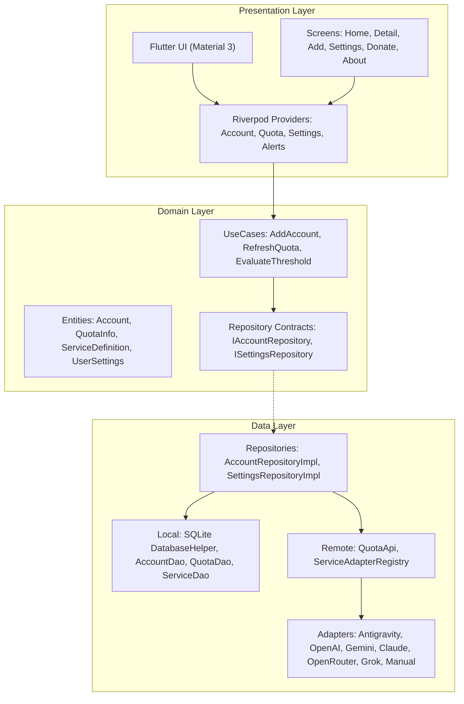
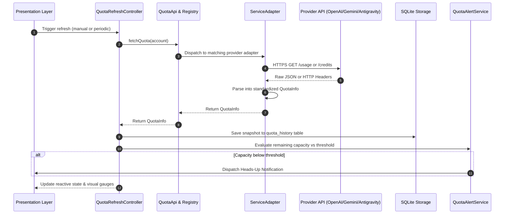

# QuotaPilot

Know your limits. Track and monitor AI API quotas, remaining balances, and rate limits in one unified, local-first dashboard.

---

## Overview

QuotaPilot is a cross-platform client application built with Flutter that provides real-time visibility into usage and capacity limits across popular Large Language Models and API providers. Designed with a privacy-first mindset, credentials and quota history never leave your device.

---

## Badges & Technologies

```
Framework: Flutter 3.24+ | Language: Dart 3.5+ | State Management: Flutter Riverpod 2.5
Database: SQLite (sqflite) | HTTP Client: Dio | Charts: fl_chart | Local Notifications: flutter_local_notifications
Architecture: Clean Architecture (Domain, Data, Presentation)
```

---

## Core Features

- Multi-Provider Support: Native adapters for Antigravity (free tier & API), OpenAI, Google Gemini, Anthropic Claude, OpenRouter, and xAI Grok.
- Manual Quota Tracking: Built-in manual counter and token tracker for unmetered or offline instances (Ollama, LocalAI, internal corporate LLMs).
- Proactive Threshold Alerts: Configurable background alerts notify you before API exhaustion disrupts active workflows.
- Dynamic Multi-Theme Engine: Supports System Default, Modern Light, Deep Nebula Dark, and True Pitch Black OLED mode with customizable accent palettes (Cyber Indigo, Neon Emerald, Sunset Amber, Cosmic Violet).
- Historical Trends & Visualizations: Line charts display historical quota depletion trends over time.
- Offline-First Data Isolation: Zero telemetry or analytics servers. Direct client-to-provider HTTPS transport.
- Monetization & Support Flow: Multi-tier supporter perks, PayPal QR integration, and native SegWit/EVM/Solana cryptocurrency support.

---

## System Architecture

<details>
<summary>Click to expand Architecture Diagram</summary>



</details>

<details>
<summary>Click to expand Quota Synchronization Flow</summary>



</details>

---

## Technical Documentation

Detailed technical documentation is available in the [`docs/`](docs/) directory:

- [System Architecture](docs/ARCHITECTURE.md): Architectural layers, directory structure, state management, and security model.
- [Service Adapters & Integration](docs/SERVICES_AND_ADAPTERS.md): Adapter contracts, supported provider endpoints, and adding new services.
- [Quota Tracking & Alert Workflow](docs/QUOTA_TRACKING_WORKFLOW.md): Synchronization lifecycle, threshold evaluation mechanics, and background schedulers.
- [Theming & Customization](docs/THEMING_AND_CUSTOMIZATION.md): Multi-tier darkness levels, OLED AMOLED support, and color palettes.
- [Deployment & Play Store Guide](docs/DEPLOYMENT_AND_PLAYSTORE.md): Keystore generation, release builds, and Google Play Store submission steps.

---

## Getting Started

### Prerequisites

- Flutter SDK (version 3.24.0 or higher)
- Dart SDK (version 3.5.0 or higher)

### Installation

1. Clone the repository:
   ```bash
   git clone https://github.com/Kennny7/quota_pilot.git
   cd quota_pilot
   ```

2. Install dependencies:
   ```bash
   flutter pub get
   ```

3. Run static analysis:
   ```bash
   flutter analyze
   ```

4. Run unit and widget tests:
   ```bash
   flutter test
   ```

5. Launch the application:
   ```bash
   flutter run
   ```

---

## Company & Studio Credits

Crafted by **LazyMoneyLabs** - Creative Software & Digital Automation.  
Website: https://lazymoneylabs.dev | Contact: contact@lazymoneylabs.dev
